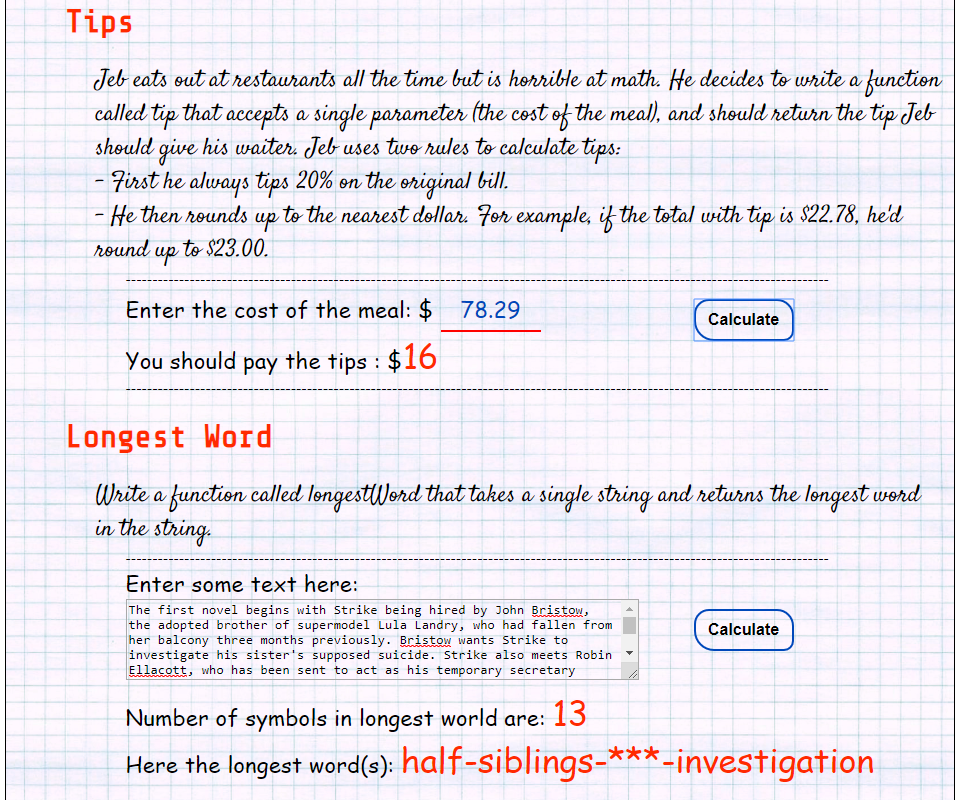

link:  https://ev-ran.github.io/JS-Functions-Katas-Collection/.
## Functions. JS Katas Collection
 

## Functions:
* . add 2 numbers
*  add  any numbers
*  multiply 2 numbers
*  multiply  any numbers
*  power / exponentiation
*  factorial
*  fibonacci 
* average
*  compare: greater than?
*  second largest 
*  contains vowel
* tips
*  longest word(s)
*  weave words
*  piglatin play
*  miltiples
* Black Jack
